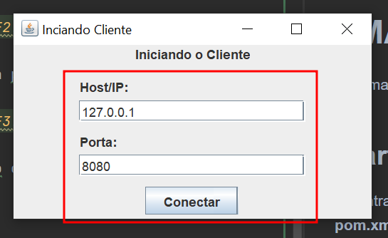
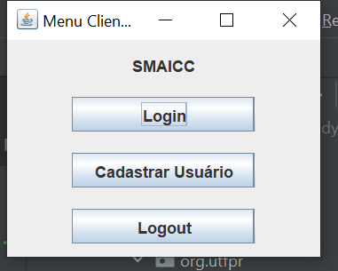

# SMAICC

Sistema de monitoramento e aviso de incidentes causados por chuvas **(SMAICC)**.

Nesse Projeto foi usado o **Java 17**.

## Configuração Iniciais (Banco de dados - MySQL)

A versão do MySQL usado nesse projeto é **8.0.33**. Acredito que qualquer versão 8.0.XX seja suficiente para funcionar como esperado.

Após **instalar** e **startar** o MySQL, execute os comandos SQL disponíveis no arquivo [database.sql](src/main/resources/database.sql) na pasta **resources**. Os comandos podem ser executados em qualquer **Editor SQL**, como MySQL Workbench, Dbeaver ou qualquer outro de sua prefeência ou até via **Terminal/CLI**.

**OBS:** A cada nova versão verifique o arquivo [database.sql](src/main/resources/database.sql), pois pode ter novas alterações e seja possível ter que apagar o banco e recriar o mesmo.

Após executar os comandos DDL vá até o arquivo [db.properties](src/main/resources/db.properties) também na pasta **resources** e substitua os dados de **user**, **password** e **dburl (Host e Porta)** para os que colocou nas configurações do MySQL instalado em sua máquina ou servidor.  

## Startando o projeto

Ao entrar no projeto é necessário baixar as dependências do Maven. Vá até o arquivo **pom.xml** e aperte o **Load/Reload**, **Generate Sources**, **Download Sources**.

## Servidor

Para executar o servidor vá até o arquivo **ServerApp** e execute a função main.

Ao iniciar a aplicação, defina sua porta e clique em **Inciar Servidor**.   

Pronto, agora só esperar a conexão com Cliente.

## Cliente

Para executar o servidor vá até o arquivo **ClientApp** e execute a função main.

Ao iniciar a aplicação, defina o Host/IP e a porta do Servidor que deseja se conectar e clique em **Conectar**.

Pronto agora é só executar as operações que desejar: **Cadastrar Usuário**, **Login**, **Logout**.

