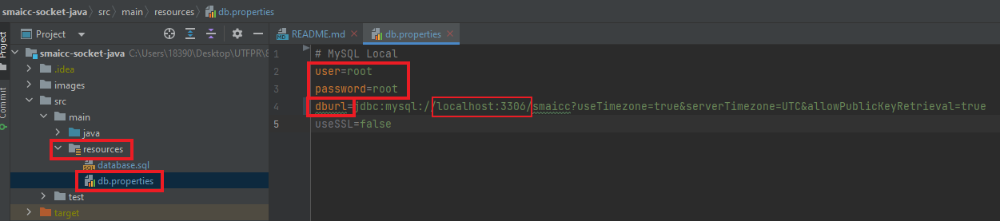

# SMAICC

Sistema de monitoramento e aviso de incidentes causados por chuvas **(SMAICC)**.

Nesse Projeto foi usado o **Java 17**.

## Startando o projeto

Ao entrar no projeto é necessário baixar as dependências do Maven. Vá até o arquivo **pom.xml** e aperte o **Load/Reload**, **Generate Sources**, **Download Sources**.

## Servidor

Para executar o servidor vá até o arquivo **ServerApp** e execute a função main.

Ao iniciar a aplicação, defina sua porta e clique em **Inciar Servidor**.   

Pronto, agora só esperar a conexão com Cliente.

## Cliente

Para executar o servidor vá até o arquivo **ClientApp** e execute a função main.

Ao iniciar a aplicação, defina o Host/IP e a porta do Servidor que deseja se conectar e clique em **Conectar**.

Pronto agora é só executar as operações que desejar: **Cadastrar Usuário**, **Login**, **Logout**.

